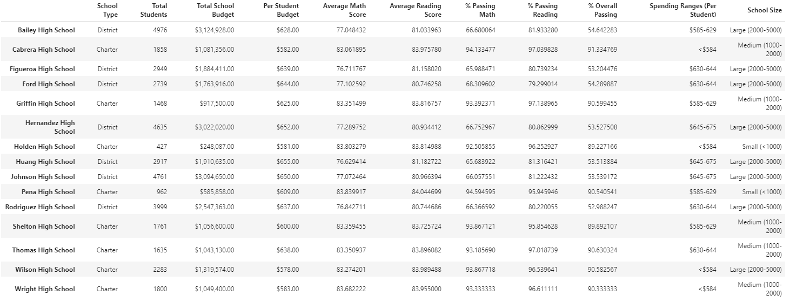

# School District Analysis 

## Project Overview
### During a review of a school district's testing analysis, the school board found evidence of academic dishonesty among the 9th grade reading and math scores at Thomas High School. I have been tasked with omitting these questionable scores, repeating the same analysis on the district and school data, and providing a comparison report of the new and previous analyses. 
Analysis metrics include:

- District Summary
- School Summary
- Top 5 performing schools, based on overall passing rate
- Bottom 5 performing schools, based on overall passing rate
- Average math score for each grade level from each school
- Average reading score for each grade level from each school
- Testing scores by school spending per student
- Testing scores by school size
- Testing sores by school type

## Resources
- JupyterLab
- Python 3.7.6
	- Dependencies
		- Python Pandas library
		- Python Numpy library
- Data Source:
	- schools_complete.csv
	- students_complete.csv

## Results
The following results display the new analysis after omission of the Thomas High School 9th grade scores:

**District Summary** 

-  The average math score decreased by 0.1
-  The percentage of students passing math decreased by 0.2%
-  The percentage of students passing reading decreased by 0.3%
-  The overall passing percentage decreased by 0.1%

**School Summary**

The only school data altered was Thomas high school through omission of 9th grade reading and math scores. This omissions affected Thomas High School's data in the following ways:

- The average math score decreased by 0.07
- The average reading score increased by 0.05
- The percentage of students passing math decreased by 0.09%
- The percentage of students passing reading decreased by 0.30%
- The overall passing percentage decreased by 0.32%

**Thomas High School's Relative Performance**

Although Thomas High School's overall passing percentage decreased, it was not enough to affect its ranking among the top performing schools. Thomas High School remained as the second highest performing school of the district.

**Scores By Grade**

- The average math scores by grade level for each school remained the same with the exception of Thomas High School 9th grade.
	- Thomas High School 9th grade math scores were omitted and listed as nan (not a number)
	

- The average reading scores by grade level for each school remained the same with the exception of Thomas High School 9th grade.
	- Thomas High School 9th grade reading scores were omitted and listed as nan (not a number)

**Scores By School Spending**

- The average testing scores and passing percentages based on school spending ranges were unaffected by the Thomas High School 9th grade score omissions.

**Scores by School Size**

- The average testing scores and passing percentages based on school size were unaffected by the Thomas High School 9th grade score omissions.

**Scores by School Type**

- The average testing scores and passing percentages based on school size were unaffected by the Thomas High School 9th grade score omissions.

## Summary

After omission of the Thomas High School 9th grade math and reading scores, the school district analysis experienced a decrease across the board in average math scores (-0.1), percentage of students passing math (-0.2%), percentage of students passing reading (-0.3%), and the overall passing percentage (-0.1%). The average reading score remained the same.

Similar results are mirrored for Thomas High School, with the school experiencing a small decrease in all scores except for the average reading score, which increased by 0.05. The decrease in overall passing percentage (-0.32%) was not significant enough to affect Thomas High School's position among top performing schools of the district.  